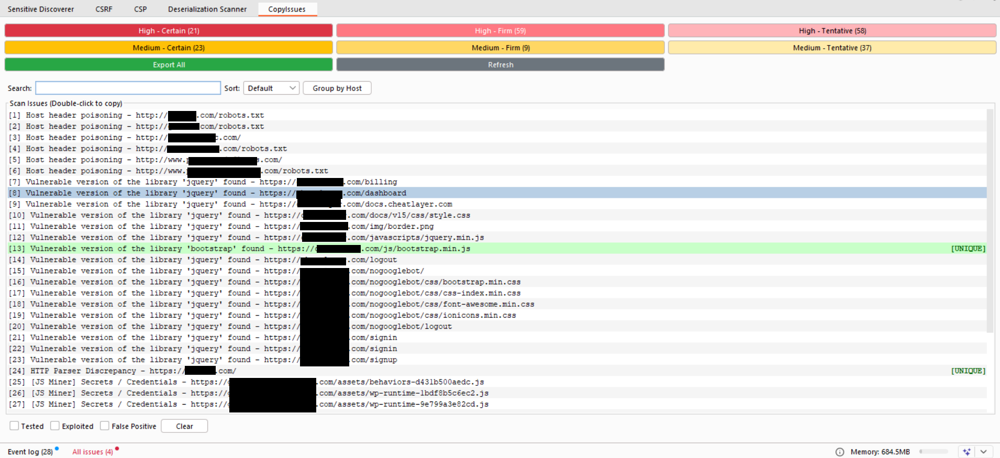
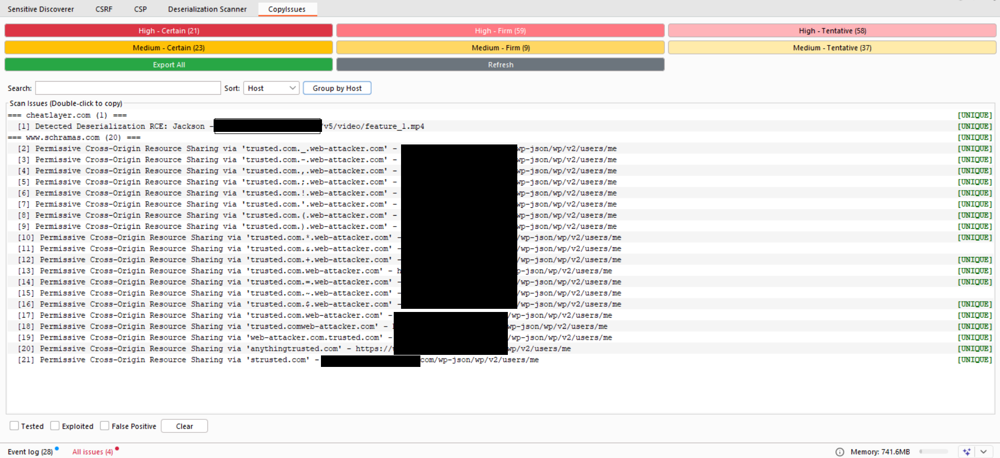
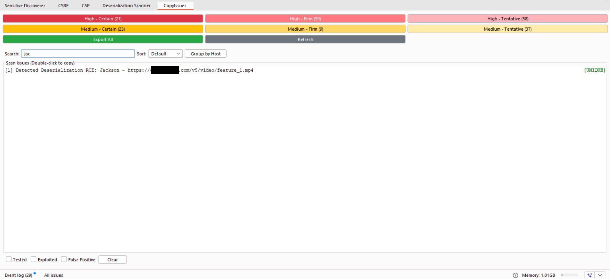
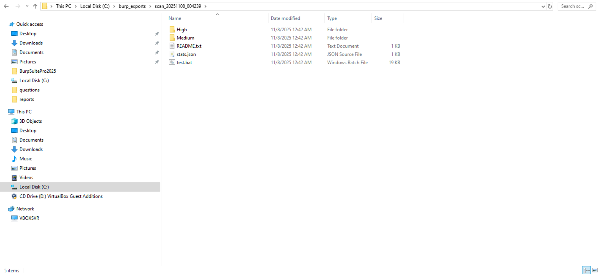

# BurpCopyIssues


Burp Suite extension for browsing, copying, and exporting scan findings.

<p align="center">
  
</p>

## Why BurpCopyIssues?

### Use Cases
- **Penetration Testing Reports**: Quickly copy findings into report templates with full technical details
- **Bug Bounty Hunting**: Export structured vulnerability data with HTTP evidence for submissions
- **Security Research**: Organize and track findings across multiple targets with status flags
- **Team Collaboration**: Share standardized JSON exports with complete request/response data
- **Vulnerability Management**: Track testing progress with Tested/Exploited/False Positive markers
- **Automation & Integration**: Use JSON exports with curl commands and Python templates for validation

### Key Benefits
- **Time Savings**: One-click copy eliminates manual formatting of vulnerability details
- **Complete Context**: Every export includes full HTTP evidence, not just summaries
- **Smart Deduplication**: Automatically identifies unique vs duplicate findings across hosts
- **Persistent Tracking**: Status flags survive Burp restarts for long-term project management
- **Ready-to-Use**: Exports include working curl commands and Python scripts for immediate testing
- **Visual Clarity**: Color-coded UI with alternating rows makes scanning hundreds of findings effortless

### What Makes It Different
- **No Manual Copying**: Double-click to copy complete vulnerability details to clipboard
- **HTTP Evidence Included**: Full request/response pairs with headers and bodies
- **Executable Exports**: curl commands and Python scripts ready to run
- **Status Persistence**: Track your testing workflow across sessions
- **Duplicate Intelligence**: Instantly see which findings are unique vs repeated
- **Organized Exports**: Structured by severity/confidence with statistics and test scripts

## Installation & Quick Start

1. Burp → Extender → Extensions → Add → Python
2. Select: `CopyIssues.py`
3. Click severity/confidence filter (e.g., "High - Certain")
4. Double-click any issue to copy to clipboard
5. Paste into your preferred tool or documentation

## Requirements

- Burp Suite (Professional or Community Edition)
- Jython Standalone JAR (https://www.jython.org/download)

## Features

Interactive UI extension for browsing, copying, and exporting scan findings.

**Features:**
- Filter by severity (High/Medium) and confidence (Certain/Firm/Tentative)
- Color-coded buttons with brightness gradients
- Alternating row backgrounds for readability
- Double-click to copy full issue details to clipboard
- Copied issues turn light green until refresh
- Refresh button to reload current filter
- Status tracking with checkboxes (Tested/Exploited/False Positive)
- Duplicate highlighting - unique issues show **[UNIQUE]** in bold green on right
- Export all issues to JSON with full HTTP evidence

**Usage:**
- Click severity/confidence filter → Double-click issue → Copy to clipboard
- Use checkboxes to mark status (Tested/Exploited/False Positive)
- Click "Refresh" to reload findings
- Click "Export All" for JSON export with full HTTP evidence

<p align="center">
  
</p>

<p align="center">
  
</p>

## Output Structure

```
~/burp_exports/scan_TIMESTAMP/  (or C:\burp_exports\ on Windows)
├── stats.json
├── README.txt
├── test.sh (or test.bat on Windows)
├── High/
│   ├── certain.json
│   ├── firm.json
│   └── tentative.json
└── Medium/
    ├── certain.json
    ├── firm.json
    └── tentative.json
```

<p align="center">
  
</p>

## JSON Export Contents

Each issue includes:
- **id** - MD5 hash for deduplication
- **timestamp** - Scan session timestamp
- **severity/confidence** - Risk level and detection confidence
- **host/url/protocol/port** - Target metadata
- **finding** - Vulnerability name
- **description/background/remediation** - Full details
- **insertion_points** - Vulnerable parameters (URL/Body/Cookie)
- **http_evidence** - Complete request/response pairs with headers/bodies
- **base_request** - Full request details with query_params, cookies, headers
- **curl_command** - Ready-to-use curl command
- **python_request_template** - Working Python script with requests library

## Status Tracking

- **Tested**: Mark issues you've manually tested
- **Exploited**: Mark successfully exploited vulnerabilities
- **False Positive**: Mark issues that are false positives
- **Clear**: Remove all status flags for selected issue
- Status persists across Burp restarts

## Duplicate Detection

Issues are grouped by host + vulnerability type:
- **[UNIQUE]** marker appears on right for single occurrences
- Duplicates have no marker
- Helps prioritize unique attack vectors

## Supported Vulnerabilities

Displays all High and Medium severity issues detected by Burp Scanner, including but not limited to:
- SQL injection, XSS, Code/Command injection
- Path traversal, XXE, SSRF, Deserialization
- Authentication bypass, CSRF, CORS
- File upload, Template injection
- Host header attacks, Open redirect
- LDAP injection, HTTP smuggling
- And any other High/Medium severity findings from Burp's scanner

## Technical Details

- **Deduplication**: MD5 hash of host+URL+issue_name
- **Encoding**: UTF-8 handling for non-ASCII characters
- **Truncation**: Request/response bodies limited to 5KB
- **Filtering**: Only High and Medium severity issues
- **UI Colors**: 
  - Severity buttons: Dark → light gradients (Certain → Tentative)
  - Copied rows: Light green background
  - Unique issues: Bold green **[UNIQUE]** marker on right
- **Status Persistence**: Saved to `~/burp_exports/issue_status.json` (or `C:\burp_exports\` on Windows)
- **Cross-platform**: Works on Windows, Linux, and macOS
- **Performance**: Limited to first 2 HTTP messages per issue, 20 headers max

## Changelog

### v1.0.0 (2024)
- Initial release
- Filter by severity (High/Medium) and confidence (Certain/Firm/Tentative)
- Double-click to copy issue details to clipboard
- Color-coded UI with alternating row backgrounds
- Status tracking (Tested/Exploited/False Positive)
- Duplicate detection with [UNIQUE] markers
- JSON export with full HTTP evidence
- curl commands and Python request templates
- Search and sort functionality
- Group by host feature
- Cross-platform support (Windows/Linux/macOS)
- Status persistence across Burp restarts

## Author

Developed by [Teycir Ben Soltane](https://teycirbensoltane.tn)

## License

MIT License - Free to use for authorized security testing and research purposes.
